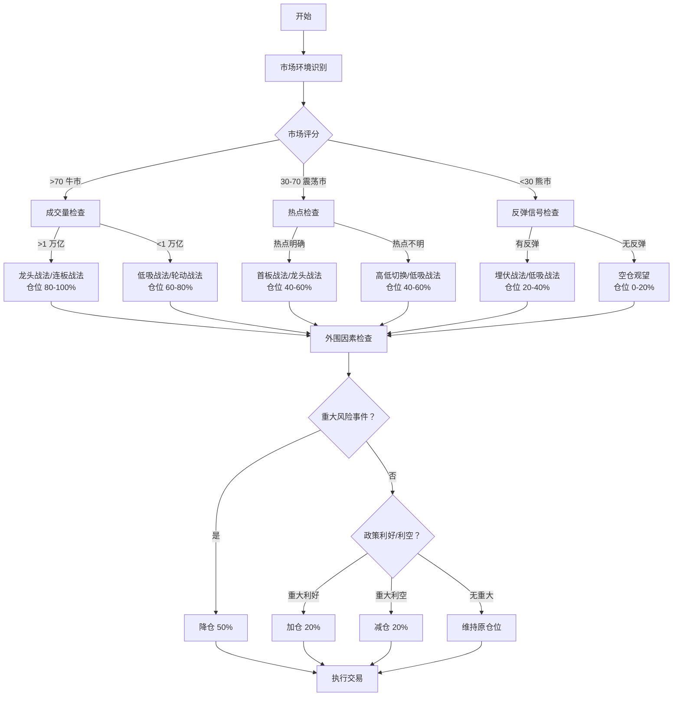

# 战法选择决策树

**版本：** v1.0  
**更新时间：** 2026-03-12

---

## 决策树流程图



---

## 详细决策逻辑

### 第一步：市场环境识别

**输入指标：**
- 上证指数位置（相对 250 日均线）
- 250 日均线斜率
- 市场宽度（新高/新低比）
- 两市成交量
- 涨停板封板率
- 连板高度

**计算公式：**
```
市场评分 = 均线系统 (25 分) + 市场宽度 (25 分) + 成交量 (25 分) + 情绪 (25 分)
```

**判定标准：**
| 评分 | 市场环境 | 基础仓位 |
|------|---------|---------|
| >70 | 牛市 | 60%-100% |
| 30-70 | 震荡市 | 40%-60% |
| <30 | 熊市 | 0%-40% |

---

### 第二步：成交量检查（牛市场景）

**逻辑：**
- 成交量>1 万亿：市场活跃，可激进操作
- 成交量<1 万亿：市场分歧，需稳健操作

**策略选择：**
| 成交量 | 推荐战法 | 仓位 | 止损策略 |
|--------|---------|------|---------|
| >1 万亿 | 龙头战法、连板战法 | 80%-100% | 宽松（15%-20%） |
| <1 万亿 | 低吸战法、轮动战法 | 60%-80% | 正常（10%-15%） |

---

### 第三步：热点检查（震荡市场景）

**热点明确信号：**
- 有清晰主线题材
- 板块内涨停>5 家
- 有连板龙头
- 板块成交量占比>20%

**策略选择：**
| 热点状态 | 推荐战法 | 仓位 | 操作要点 |
|---------|---------|------|---------|
| 热点明确 | 首板战法、龙头战法 | 40%-60% | 聚焦主线，快进快出 |
| 热点不明 | 高低切换、低吸战法 | 40%-60% | 分散布局，防守为主 |

---

### 第四步：反弹信号检查（熊市场景）

**反弹信号：**
- 指数单日涨幅>2%
- 成交量放大>30%
- 涨停家数>50 家
- 跌停家数<10 家
- 北向资金大幅流入

**策略选择：**
| 信号状态 | 推荐战法 | 仓位 | 操作要点 |
|---------|---------|------|---------|
| 有反弹 | 埋伏战法、低吸战法 | 20%-40% | 快进快出，见好就收 |
| 无反弹 | 空仓观望 | 0%-20% | 等待明确信号 |

---

### 第五步：外围因素调整

**重大风险事件：**
- VIX>30
- 地缘政治冲突升级
- 美股单日跌幅>3%
- 人民币单日贬值>0.5%

**应对：** 立即降仓 50%

**政策利好：**
- 降准/降息
- 重大产业扶持政策
- 财政刺激政策

**应对：** 加仓 20%

**政策利空：**
- 监管收紧
- 行业打压政策
- 货币收紧信号

**应对：** 减仓 20%

---

## 战法选择速查表

### 牛市环境

| 子环境 | 首选战法 | 次选战法 | 仓位 | 止损 | 止盈 |
|--------|---------|---------|------|------|------|
| 主升浪 | 龙头战法 | 连板战法 | 80%-100% | 15%-20% | 让利润奔跑 |
| 震荡期 | 低吸战法 | 轮动战法 | 60%-80% | 10%-15% | 20%-30% |

### 震荡市环境

| 子环境 | 首选战法 | 次选战法 | 仓位 | 止损 | 止盈 |
|--------|---------|---------|------|------|------|
| 热点明确 | 首板战法 | 龙头战法 | 40%-60% | 8%-12% | 15%-25% |
| 热点轮动 | 高低切换 | 低吸战法 | 40%-60% | 8%-12% | 15%-20% |
| 无热点 | 埋伏战法 | 空仓 | 20%-40% | 5%-10% | 10%-15% |

### 熊市环境

| 子环境 | 首选战法 | 次选战法 | 仓位 | 止损 | 止盈 |
|--------|---------|---------|------|------|------|
| 反弹期 | 低吸战法 | 埋伏战法 | 20%-40% | 5%-10% | 10%-15% |
| 主跌浪 | 空仓观望 | 轻仓试错 | 0%-20% | 3%-5% | 5%-10% |

---

## 实战决策清单

### 每日盘前检查

- [ ] 市场环境评分计算
- [ ] 外围市场隔夜表现
- [ ] 重要政策/事件日历
- [ ] 昨日涨停今日溢价
- [ ] 涨跌停家数统计

### 盘中监控

- [ ] 成交量变化
- [ ] 热点板块轮动
- [ ] 龙头股表现
- [ ] 北向资金流向
- [ ] 期指基差变化

### 盘后复盘

- [ ] 当日交易回顾
- [ ] 市场环境变化
- [ ] 策略有效性评估
- [ ] 明日计划制定
- [ ] 风险点梳理

---

## 仓位管理公式

```python
def calculate_position(market_score, external_risk, policy_signal):
    """
    计算建议仓位
    
    market_score: 市场评分 (0-100)
    external_risk: 外部风险 (-1, 0, 1)
    policy_signal: 政策信号 (-1, 0, 1)
    """
    # 基础仓位
    if market_score > 70:
        base_position = 0.8
    elif market_score > 30:
        base_position = 0.5
    else:
        base_position = 0.2
    
    # 外围风险调整
    if external_risk == 1:
        base_position *= 0.5
    elif external_risk == -1:
        base_position *= 1.2
    
    # 政策信号调整
    base_position += policy_signal * 0.2
    
    # 仓位限制
    position = max(0, min(1, base_position))
    
    return position
```

---

## 注意事项

1. **决策树是指导，不是教条** - 需结合实际情况灵活调整
2. **仓位管理是核心** - 再好的策略也需要合理仓位配合
3. **止损是生命线** - 严格执行止损，保护本金
4. **持续学习进化** - 市场在变，策略也需进化
5. **心态管理** - 避免情绪化交易，保持理性

---

**文档版本：** v1.0  
**创建时间：** 2026-03-12  
**适用市场：** A 股
